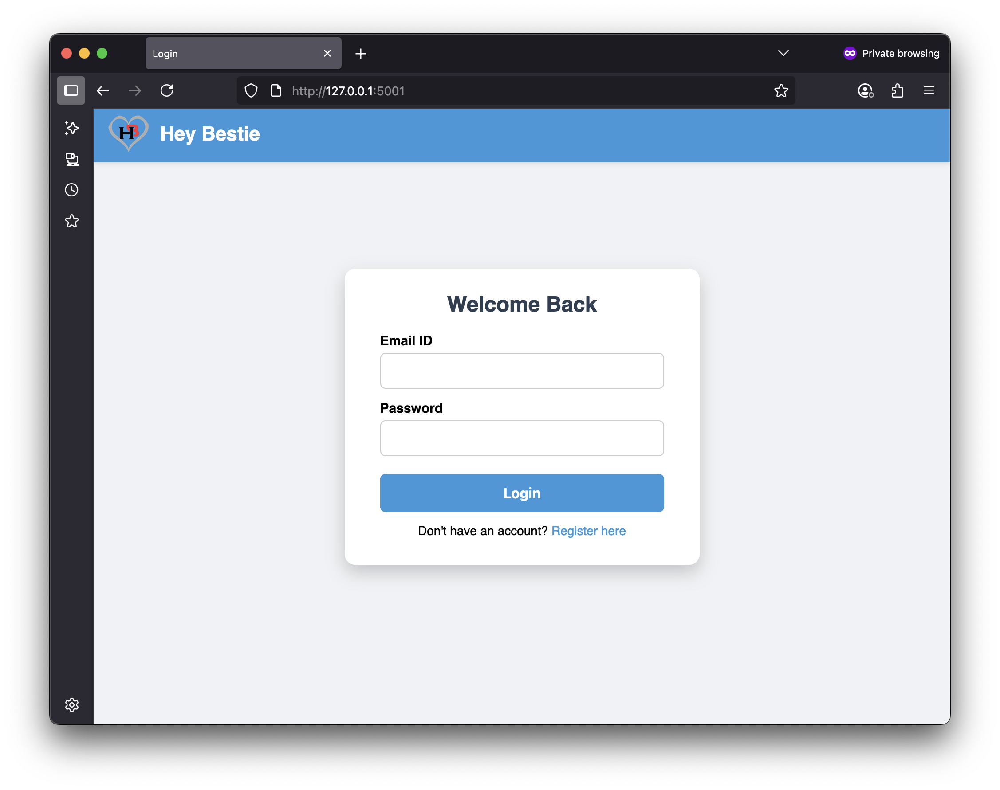
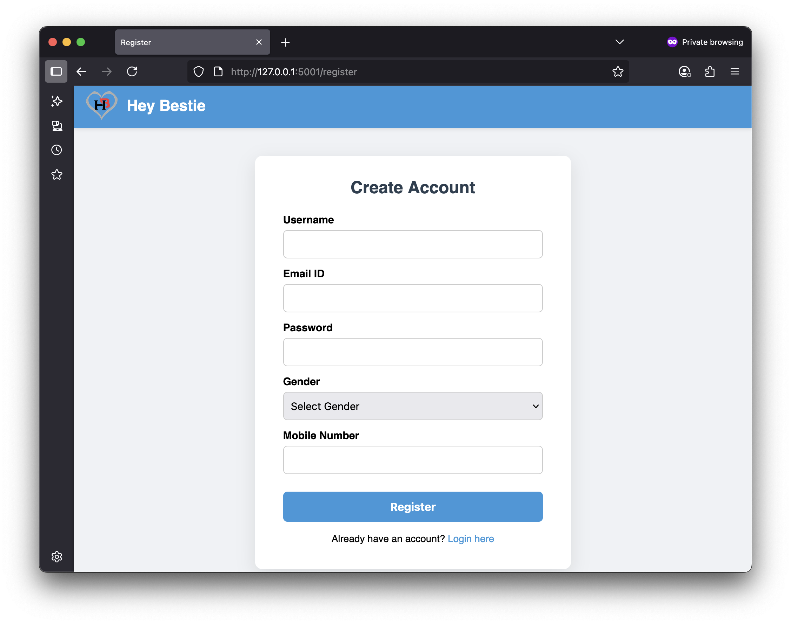
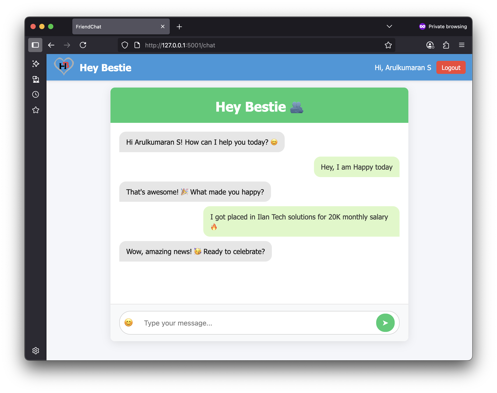
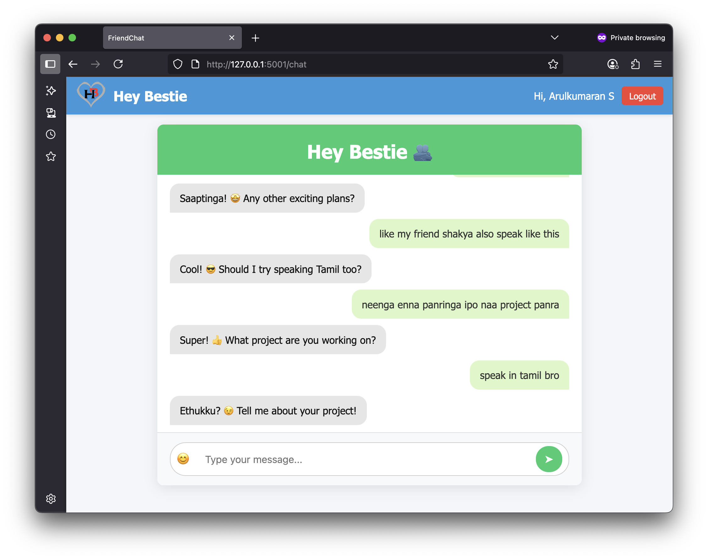

# Hey Bestie

Hey Bestie is a fun and lively friendship chatbot designed to help users break out of their shells through engaging, humorous conversations. Inspired by Jarvis but with a twist of sass and warmth, it adapts to users as either Elena or Jace — your virtual best friend. The bot keeps chats energetic using quick, witty one-liners and always asks playful questions. It’s built to support introverts in becoming more expressive, confident, and connected. No robotic talk — just pure vibes and fun, like your real-life bestie.

## 🚀 Features

- Dual personalities: Elena (girl BFF) or Jace (boy BFF)
- Responds in fun 5-word lines with short questions
- Boosts user confidence through humor
- Maintains a warm, teasing tone like a real best friend
- Built with OpenAI & Gemini APIs

## 📦 Requirements

Make sure you have Python 3.8+ installed. Then install the required modules:

```bash
pip install openai google-generativeai argparse
```

### 1. Login Page


### 2. Register Page


### 3. Chat Section 

